# <h1 align ="center"> WEvolve ☯ </h1>

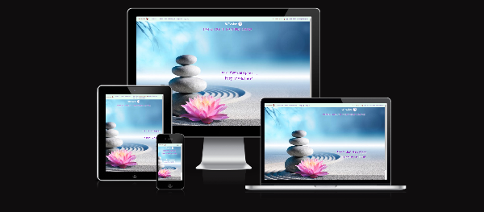

---

[Welcome to Mental health treatment centre WEvolve](https://wevolve-mhc.herokuapp.com/)

 WEvolve is a website of mental healthcare centre that relies on holistic methods and individual, tailor-made treatment programmes as well as classical methods, to restore the balance between body, mind and soul. The centre offers treatments for a variety of mental health issues, such as mental health disorders, eating disorders, depression, panic attacks, PTSD, ADHD, OCD, burnout, personality disorder, addictions and other. Mental and physical health are equally important components of overall health. This site is targeted towards people who are searching for the mental calmness.

---
### Strategy

Project purpose is
* to provide for the user info about mental health issues and treatment providing in the clinic;
* to let user sign up for mental health treatment package;
* to let user book/reschedule/cancel appointment;

### User Experience(UX) and Agile method
#### Site User
* As a user I want to easily navigate the website and book the appointment if needed.
* As a user I want to have a confirmation so that I know the booking worked.
* As a user I want to be able to cancel my booking if I don't need it anymore.
* As a user I want to be able to reschedule/edit my booking.
* As a user I want to be able to create an account so that I can see my bookings.

#### Site owner (Staff Memmber)
* As a Superuser I can see what time has been booked so that I can plan ahead.
* As a Superuser I can see contact details about the user so that I can contact the user if needed.
* As a Superuser I can edit/delete an appointment if necessary.
* As a Superuser I can delete User if necessary to keep the schedule board clean.

In this project GitHubs project board was used to keep track of user stories. This is helpful for a big project, so developer is able to break down every user story to smaller pieces and keep track of what is left.

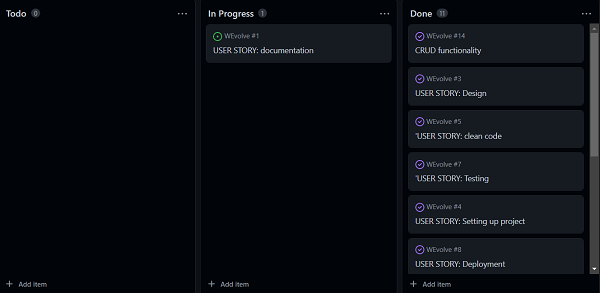

---

### Lucidchart and Data model

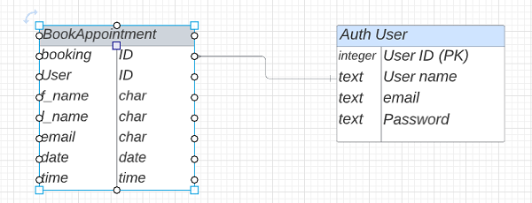

### Design
The idea of the website and clinic in general revolves around Oriental culture, which represents physical and mental calmness, peace and health. Oriental culture is represented in motivational quotes scattered along the pages.
The font-family is Yeong Sang, that looks like japanese hieroglyphics. All pages has different color palette, but all the colors compliment each other, contrast the backgdound image, are soothing and eye pleasing.

### Future Features
In the future website should have a gallery with the pictures of treatment clinic (resort), the staff and specialists.
The website will provide links and learning material for different coping mechanism related to mental issues (such as meditations, releasing stored traumas through physical activities etc).

### Features
The Landing page has the menu with easy navigation, Sign Up/Sign In buttons. The user isn't able to book an appointment with specialist without having an account and not signed in. It has a logo of the clinic and a motivational quote. 

The Navigation bar (menu) on every page looks the same, but presented in different colors to compliment and make a contrast with the background respectively. It is simple and responsive. It has a link to the landing page, represented with the logo and the name of the clinic, contact section with links to the social media, telephone numder and email address, link to the About the clinic page, links to pages that represent different cases of mental issues the clinic treats (such as addiction problems, mental health issues and holistic health phylosophy). There's also link to the page with prices for the treatment. 

The sign up page and sign in page look similar

The contacts page shows the map with the location and all the contact info.

The About page gives User the obvious glimpse of what the mental health treatment centre WEvolve is. 

The page about mental health issues WEvolve treats has all the info user needs regardless this topic as well as the menu with the opportunity to book an appointment (if the User is authenticated).

The page telling about what the addiction is and how the treatment centre deals with it.

The page that gives a User info about holistic health practices WEvolve implements for mental issues treeatment as well as classic clinical treatment.

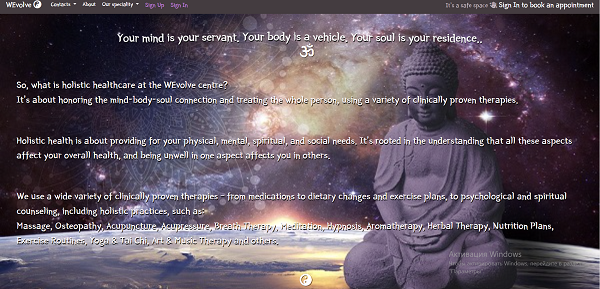

The page with prices info
All the pages have the back tag that takes the user to the top of the page.

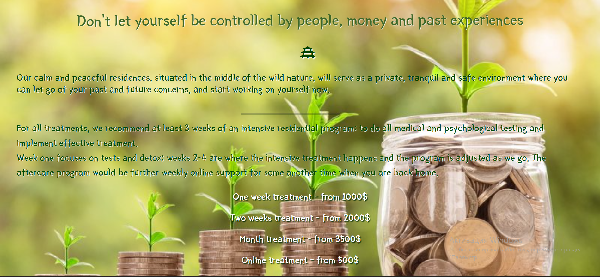

The page with the booking form, where only authenticated User can book an appointment in the clinic.
The form contains all the necessary fields such as first name, last name, email, date and time of appointment.

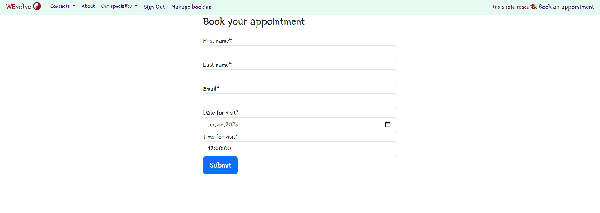

The User page where they can manage their appointments (reschedule/cancel).

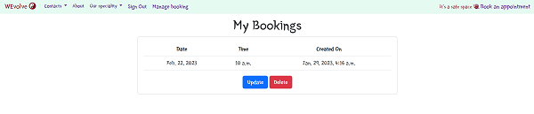

The page where staff can manage all appointments (reschedule them by demand and cancel as well).

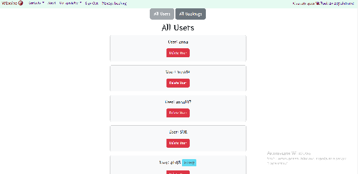

The website has a logo adn it has a footer on the landing and contact pages.

---

### Technology used:
#### Languages used
* HTML5
* CSS
* JavaScript
* Python

#### Frameworks and libraries used
* Django
* jQuery
* Bootstrap 4
* Google Fonts
* Fontawesome
* Favicon
* Cloudinary  
* Lucidchart

### Testing
#### Lighthouse Testing
The application has been tested with Chrome Dev Tools Lighthouse Testing which tests the application for:

* Performance
* Accessibility
* Best Practices
* SEO

Landing page

About page

Contact page

Mental health page

Addiction page

Holistic health page

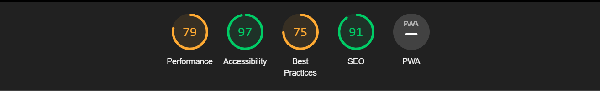

Prices page

Booking form page

---

### Browser Testing
The website is tested on the following browsers with no known issues:

* Opera
* Google Chrome (desktop and mobile version)
* Safari for iOS

### Manual testing
A lot of testing has been done by myself and some friends. Trying different inputs to forms, clicking links, entering URLs manually, making inputs, edit and deleting them.

* All links are working.
* Clicking on the logo gets you back to the home page, clicking on the logo at the bottom of the page gets you at the top of the page.
* If you try to access a page which requires the user to be logged in, you are redirected to the login page.
* If you manually try to access a page you don't have permission to view you will get redirected to home.
* User can only see his bookings if user is not a staff member.
* An alert is showing everytime a user tries to delete something.
* A confirmation message is shown when something is performed.
* All CRUD (Create, Read, Update, Delete) functionality is working as it should.

Validator Testing
WEvolve has been successfully tested by using validation tools for HTML, CSS, JavaScript and Python respectively.

* W3C HTML Validator
* W3C CSS Validator

* JSHint JavaScript Validator

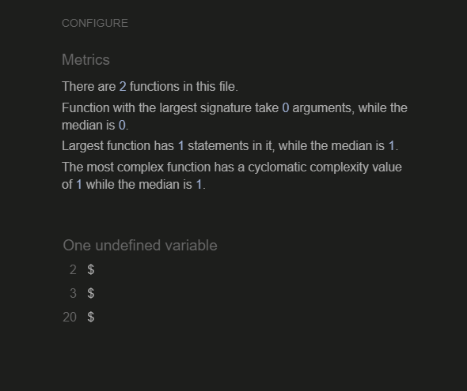

* PEP8 Online Validator was tested in the Gitpod workspace.

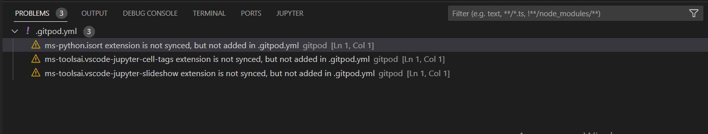

No issues were found.

---

### Libraries
The following libraries are used in the project and are located in the requirements.txt file:

* asgiref==3.6.0
* cloudinary==1.31.0
* dj-database-url==0.5.0
* dj3-cloudinary-storage==0.0.6
* Django==3.2.16
* django-allauth==0.52.0
* django-crispy-forms==1.14.0
* django-summernote==0.8.20.0
* gunicorn==20.1.0
* oauthlib==3.2.2
* psycopg2==2.9.5
* PyJWT==2.6.0
* python3-openid==3.2.0
* pytz==2022.7.1
* requests-oauthlib==1.3.1
* sqlparse==0.4.3

### Bugs and unfixed bugs
While I was early deploying to Heroku, I got an error and the app wasn't working. 

The issue was that the cloudinary storage wasn't install properly in requirement.txt file. The issue was fixed and the app successfully was deployed.

### Deployment:
The project was deployed to Heroku using the following steps:

* Create a new Heroku app
* Add all necessary config vars (Secret_key, cloudinary, port etc).
* Link the Heroku app to the repository
* Push final code via the terminal after finishing the project.
* Select 'deploy'.

#### Elephant SQL
The database was set up by following the steps beneath:

* Log in to ElephantSQL.com to access your dashboard
* Click “Create New Instance”
* Set up your plan
* Select “Select Region”
* Select a data center near you
* Click “Review”
* Check your details are correct and click “Create instance”
* Return to the ElephantSQL dashboard and click on the database instance name for this project
* In the URL section, click the copy icon to copy the database URL
* The proper steps were taken in the settings.py file to connect with the database.

---

### Credits
Design ideas were taken from the walkthrough project "Bootstrapping Your Next Big Idea With Bootstrap 4";
some code was taken from walkthrough projects "Hello Django" and "I think therefore I blog".
The idea of the website was taken partly from [Balance luxury rehab](https://balanceluxuryrehab.com/).
Some ideas were taken from youtube tutorials: [Build a doctor website with django](https://www.youtube.com/watch?v=3_3q_dE4_qs&ab_channel=SelmiTech), [Build dental appointment form](https://www.youtube.com/watch?v=rHZwE1AK1h8&ab_channel=Codemy.com),[Django tutorial on how to create a booking system for health clinic](https://blog.devgenius.io/django-tutorial-on-how-to-create-a-booking-system-for-a-health-clinic-9b1920fc2b78).
